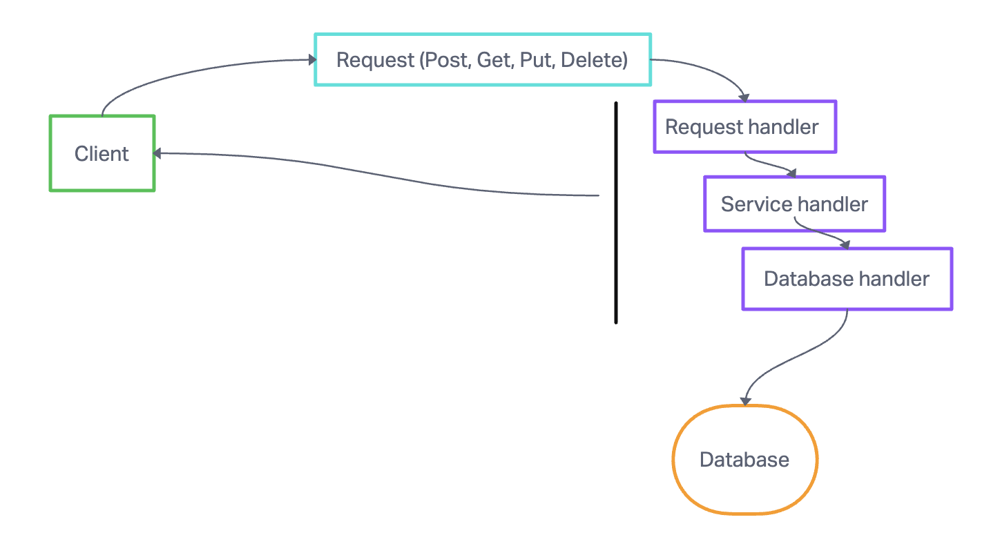
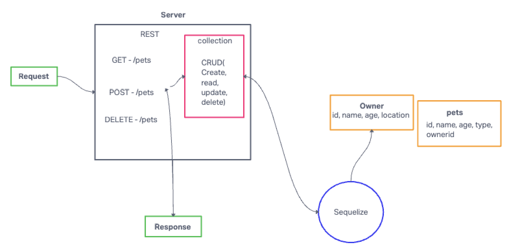

# API server

## Author: Tricia Sawyer

### Problem Domain

Create a simple rest api with a sql database and express server

### Initializing and Running the Application

- Clone repo down
- run `npm install`
- run `nodemon`
- run the command `npm test`

### Routes

404 bad route : /foo
GET : /pet
GET : /pet/:id
GET : /owner
GET : /owner/:id
POST : /pet
POST : /owner
PUT : /owner/:id
PUT : /pet/:id
DELETE : /owner/:id
DELETE : /owner/:id

### Deployed version

[Render deploy](https://api-server-prod-3588.onrender.com)

### Links and Resources

- [GitHub Actions ci/cd]
- [back-end dev server url]
- [back-end prod server url]

### UML

### PR links

[My PR:](https://github.com/triciasawyer/api-server-ethanStorm/pull/1)
[Ethan's PR:](https://github.com/triciasawyer/api-server/pull/2)
