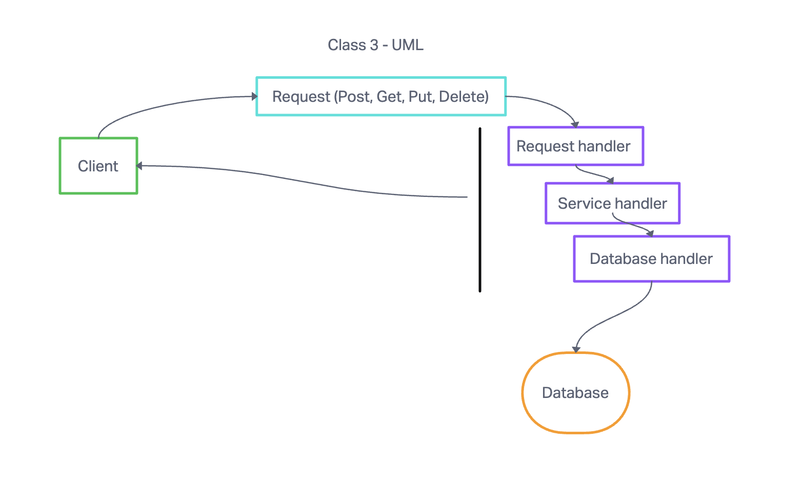
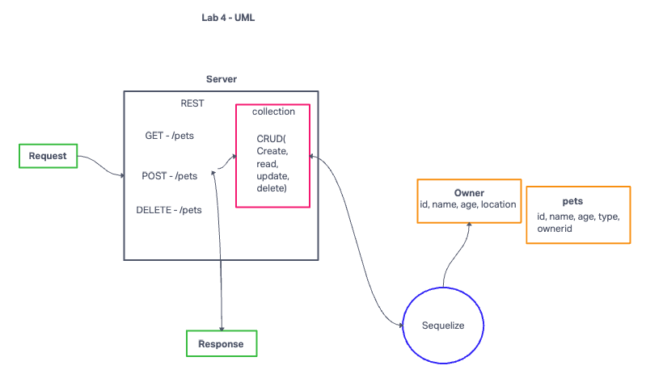

# LAB- Class 4

## Project: api server

### Author: Tricia Sawyer

### Problem Domain

Create a simple rest api with a sql database and express server

### Links and Resources

- [GitHub Actions ci/cd](https://github.com/triciasawyer/basic-express-server/actions)
- [back-end dev server url](https://basic-express-server-dev-4sx4.onrender.com)
- [back-end prod server url](https://basic-express-server-prod-jtnf.onrender.com)

### Collaborators

Got help from a TA, Tony in lab 3

### Setup

.env requirements (where applicable)
port variable exists within the env sample

How to initialize/run your application (where applicable)
clone repo, npm i, then run nodemon in the terminal

#### Routes

404 bad route : /foo
GET : /pet
GET : /pet/:id
GET : /owner
GET : /owner/:id
POST : /pet
POST : /owner
PUT : /owner/:id
PUT : /pet/:id
DELETE : /owner/:id
DELETE : /owner/:id

#### Tests

to run tests, after running `npm i`, run the command `npm test`

#### Deployed version

[Render deploy](https://api-server-prod-3588.onrender.com)

#### PR

[PR 1(basic-api)](https://github.com/triciasawyer/api-server/pull/1)
[PR 2(modeling)](https://github.com/triciasawyer/api-server/pull/3)

#### UML

### code review process

My partner was Ethan, and my key takeaway was that I do know how to read code, I am getting better at reading other peoples code too and today was that realization of where I am at with my understanding, and noticing that I am growing.

[My PR:](https://github.com/triciasawyer/api-server-ethanStorm/pull/1)
[Ethan's PR:](https://github.com/triciasawyer/api-server/pull/2)
